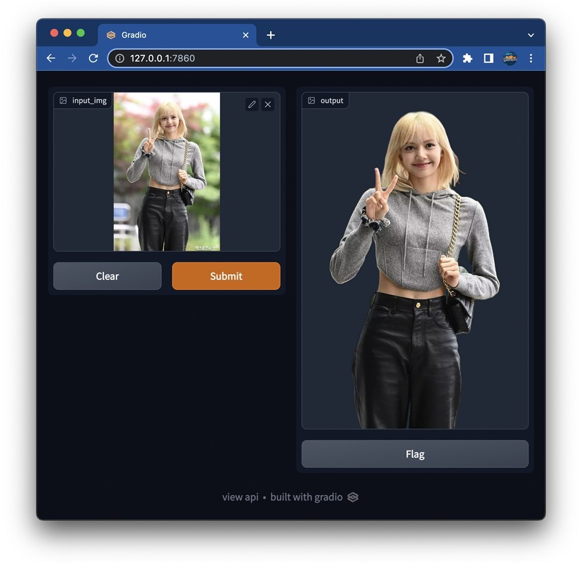

# Gradimio-rembg
A basic example of [Gradimio](https://github.com/geeksloth/gradimio/ "Gradimio") template. This is integrated of [Gradio](https://gradio.app/ "Gradio"), [RemBG](https://pypi.org/project/rembg/ "RemBG"), numpy and other.




# Getting Started
1. Clone this repo and get into it
```bash
git clone https://github.com/geeksloth/gradimio-rembg.git && cd gradimio-rembg
```
2. Run the container
```bash
docker-compose up
```
3. Access it via your browser:
```127.0.0.1:7860```

# Optional customization
* If you have GPU support, modify the ```Dockerfile``` to change ```rembg``` to ```rembg[gpu]```.

# Offcial docs
1. Gradio https://gradio.app/
2. RemBG https://pypi.org/project/rembg/
